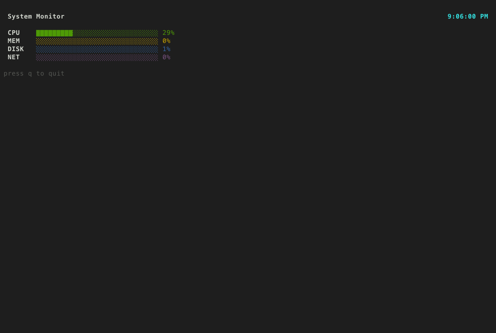
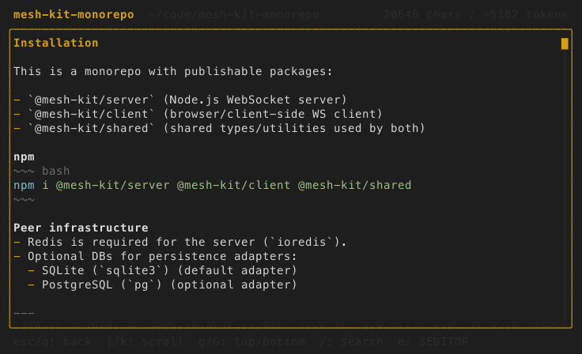
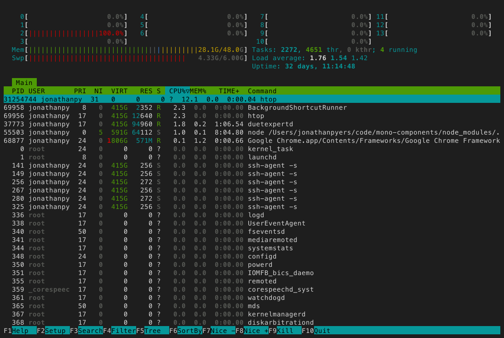

# tui-mcp

What [Chrome DevTools MCP](https://github.com/ChromeDevTools/chrome-devtools-mcp) is for the browser, tui-mcp is for the terminal.

Launch any terminal app in a managed pty, take screenshots, read text, send keystrokes. The app thinks it's running in a real terminal. Works with any TUI framework or no framework at all - vim, htop, bubbletea, textual, ink, inquirer, trend, ncurses, whatever.

<p align="center">
  <a href="https://glama.ai/mcp/servers/nvms/tui-mcp">
    
  </a>
</p>

## How is this different from a bash tool?

A bash tool runs discrete commands - each invocation is fire-and-forget. The process exits, the output comes back. tui-mcp maintains a **persistent, interactive session**. The pty stays alive between calls. This matters when:

- **The tool has state** - you're in a `mysql` shell, you've `USE`d a database, you're in a transaction. A bash tool can't hold that session open between calls.
- **The tool has UI** - htop, vim, k9s, lazygit. A bash tool gets garbage back because these apps paint full-screen interfaces with ANSI escape codes. tui-mcp renders them into a readable screenshot or text snapshot through xterm emulation.
- **The interaction is multi-step** - SSH prompts for a password, then a 2FA code, then you're in. An interactive installer asks questions. `git rebase -i` drops you into an editor. These are conversational flows that a stateless bash tool can't handle.
- **You need to watch something** - tail a log, monitor a build, wait for a deploy to finish. The session stays open, the agent can snapshot whenever it wants to check progress.
- **The tool requires a TTY** - some CLIs behave differently (or refuse to run) without a real terminal. node-pty gives them a real pty with `xterm-256color`, so everything works as expected.

A bash tool is `exec()`. tui-mcp is "sit down at a terminal and use it like a human." One runs commands, the other operates software.

Some example outputs of the `screenshot` tool:





## Setup

```bash
claude mcp add --scope user tui-mcp -- npx tui-mcp
```

## Tools

| Tool | Description |
|------|-------------|
| **launch** | Spawn a TUI app in a managed pty |
| **kill** | Terminate a session |
| **list_sessions** | List active sessions |
| **resize** | Resize the terminal |
| **screenshot** | Capture terminal as PNG |
| **snapshot** | Capture terminal as plain text |
| **read_region** | Read a rectangular area of the buffer |
| **cursor** | Get cursor position |
| **send_keys** | Send a keystroke or combo (`Enter`, `Ctrl+C`, `Up`, `q`) |
| **send_text** | Type a string of characters |
| **send_mouse** | Send mouse events |
| **wait_for_text** | Wait for a regex pattern to appear |
| **wait_for_idle** | Wait until the terminal stops changing |

## Interesting use cases

- remote ops: agent SSHs into a production box, tails logs, greps for errors, restarts a service, watches it come back up. it's reading the same terminal output a human SRE would see. no custom APIs needed.
- legacy system interaction: ncurses admin panels, mysql cli, redis-cli, psql - the agent can drive all of these. stuff that will never get a REST API.
- multi-session orchestration: agent launches 3-4 sessions simultaneously. one running a dev server, one running tests, one tailing logs, one in a debugger. it's basically pair programming with an extra set of hands.
- interactive debuggers: gdb, lldb, pdb, node --inspect. the agent can set breakpoints, step through code, inspect variables.
- infrastructure as conversation: kubectl, terraform, docker, aws cli. agent doesn't need the kubernetes MCP server or the AWS MCP server. it just uses the CLIs directly, same as a human would.

Most MCP servers wrap one specific tool or API. tui-mcp wraps the terminal itself, which is the universal interface that all tools already speak. It's MCP's `eval()`.

## Monitor

Watch all active sessions in real-time from your terminal:

```bash
npx tui-mcp monitor
```

Session list on the left, live ANSI-rendered terminal preview on the right. j/k to navigate sessions, Enter to toggle fullscreen, q to quit. Requires the MCP server to be running.

## How it works

```
your app  <-->  node-pty  <-->  xterm-headless  <-->  MCP tools
                (pty)        (terminal emulator)    (screenshot, send_keys, etc.)
```

The app runs in a real pseudo-terminal via [node-pty](https://github.com/microsoft/node-pty). Its output is parsed by [xterm-headless](https://github.com/xtermjs/xterm.js) (the same terminal emulator that powers VS Code's terminal, but without a DOM). The MCP tools read and interact with that parsed buffer.