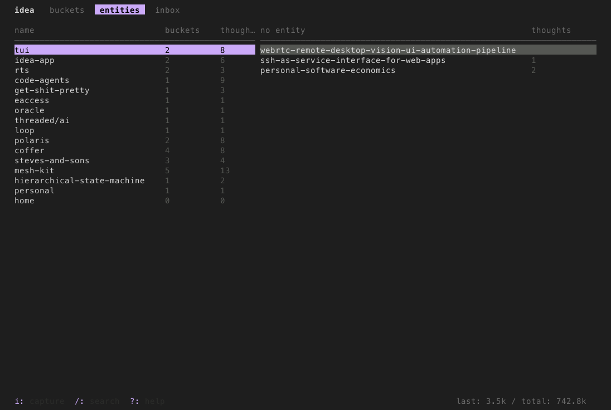

# tui-mcp

What [Chrome DevTools MCP](https://github.com/anthropics/anthropic-mcp-chrome-devtools) is for the browser, tui-mcp is for the terminal.

Launch any terminal app in a managed pty, take screenshots, read text, send keystrokes. The app thinks it's running in a real terminal. Works with any TUI framework or no framework at all - vim, htop, bubbletea, textual, ink, inquirer, trend, ncurses, whatever.





## Setup

```bash
claude mcp add --scope user tui-mcp -- npx tui-mcp
```

## Tools

| Tool | Description |
|------|-------------|
| **launch** | Spawn a TUI app in a managed pty |
| **kill** | Terminate a session |
| **list_sessions** | List active sessions |
| **resize** | Resize the terminal |
| **screenshot** | Capture terminal as PNG |
| **snapshot** | Capture terminal as plain text |
| **read_region** | Read a rectangular area of the buffer |
| **cursor** | Get cursor position |
| **send_keys** | Send a keystroke or combo (`Enter`, `Ctrl+C`, `Up`, `q`) |
| **send_text** | Type a string of characters |
| **send_mouse** | Send mouse events |
| **wait_for_text** | Wait for a regex pattern to appear |
| **wait_for_idle** | Wait until the terminal stops changing |

## How it works

```
your app  <-->  node-pty  <-->  xterm-headless  <-->  MCP tools
                (pty)        (terminal emulator)    (screenshot, send_keys, etc.)
```

The app runs in a real pseudo-terminal via [node-pty](https://github.com/microsoft/node-pty). Its output is parsed by [xterm-headless](https://github.com/xtermjs/xterm.js) (the same terminal emulator that powers VS Code's terminal, but without a DOM). The MCP tools read and interact with that parsed buffer.
